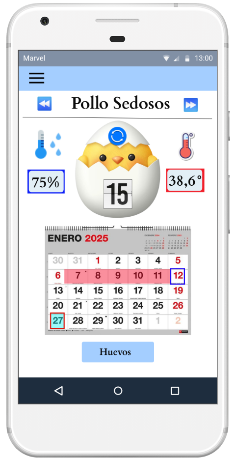
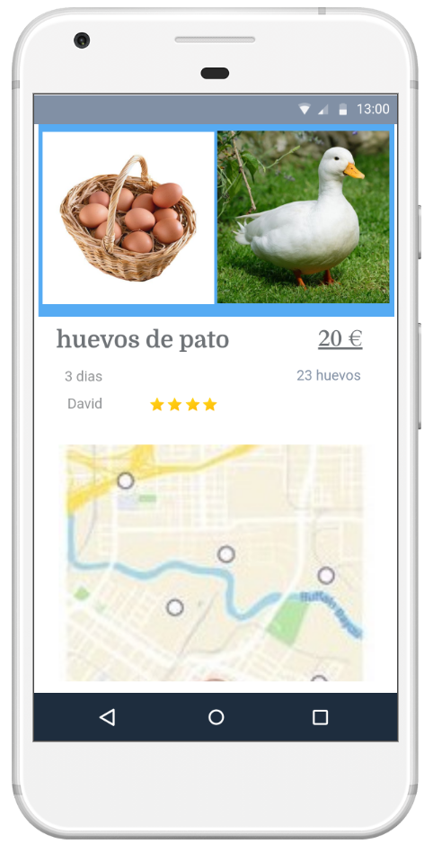
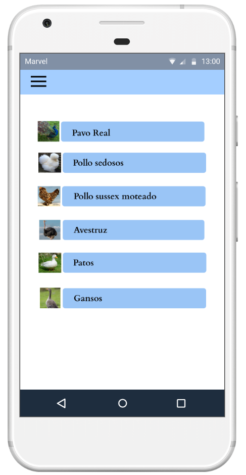

# BroodHen

BroodHen is an innovative application designed to help farmers and breeders track egg incubation stages from day one until hatching. The app combines smart incubation tracking, a specialized marketplace, and an educational library to streamline hatchery management and improve hatch rates.

## Key Features

* **Incubation Tracking:** Input egg details and receive smart notifications and alerts regarding crucial incubation stages (temperature, humidity, egg candling, etc.).
  
  (./assets/screenshots/tracking-screen_2.png)(./assets/screenshots/tracking-screen_3.png)

* **Specialized Marketplace:** A built-in store to purchase various egg types, incubation equipment, feeds, and poultry care supplies.
  
  

* **Educational Library:** An encyclopedic resource featuring best practices, guides, and tips to maximize hatch rates and improve poultry care.
  
  

## Requirements

* **Android:** OS 8.0 or higher.
* **iOS:** iOS 12.0 or higher.
* *Note: An active internet connection is required to sync data, browse the shop, and access the library.*

## Contact

For inquiries, support, or business opportunities, feel free to reach out at: [nassiba.debbah@gmail.com]